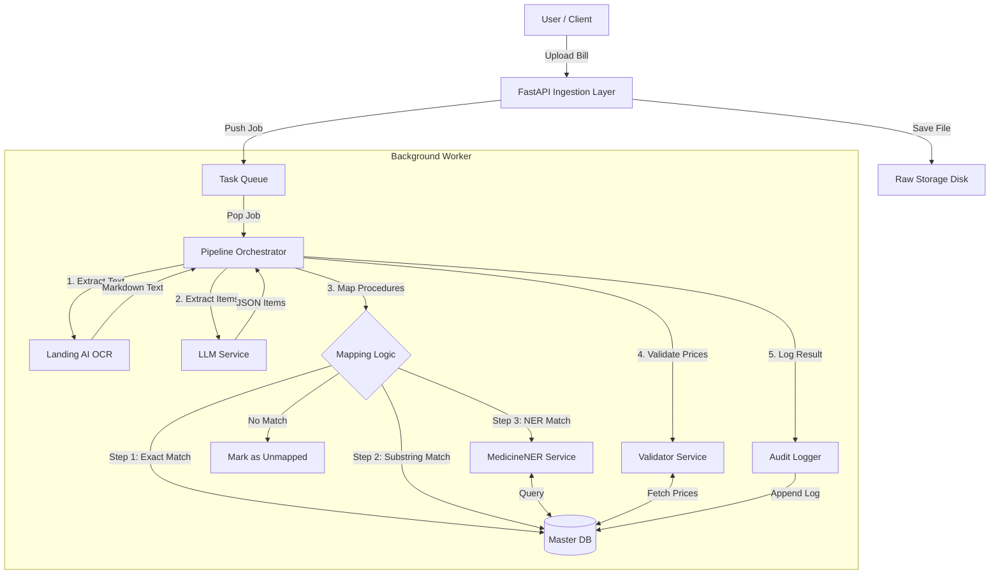

# System Architecture - Medical Bill Validation Engine

## High-Level Overview
The system is designed as a modular FastAPI application that processes medical bills through a pipeline of ingestion, OCR, LLM-based mapping, and deterministic validation.

## Component Details

### 1. Ingestion Layer ([app/api/ingestion.py](file:///Users/apple/Desktop/Medical-bills/app/api/ingestion.py))
-   **Responsibility**: Handle file uploads, validate file types (PDF, JPG, PNG), and generate a unique `bill_id`.
-   **Storage**: Files are saved to `raw_storage/{bill_id}_{filename}`.
-   **Async**: Pushes a job to the processing queue immediately after saving.

### 2. OCR Engine ([app/services/ocr.py](file:///Users/apple/Desktop/Medical-bills/app/services/ocr.py))
-   **Library**: `unstructured` (Hi-Res Strategy) + `Tesseract` (Fallback).
-   **Output**: Raw text extraction.
-   **Logic**:
    1.  Try `unstructured.partition_pdf` with table inference.
    2.  If output is empty/garbage, fallback to `pdf2image` + `pytesseract`.

### 3. LLM Service ([app/services/llm.py](file:///Users/apple/Desktop/Medical-bills/app/services/llm.py))
-   **Model**: Mistral 7B (via Ollama).
-   **Functions**:
    -   **Extraction**: Parses raw OCR text into JSON `{"item_name": "...", "price": ...}`.
    -   **Mapping**: Maps item names to Master Procedure Codes.
-   **Prompting**: Specialized prompts for extraction (JSON enforcement) and mapping (candidate selection).

### 4. Orchestrator ([app/services/orchestrator.py](file:///Users/apple/Desktop/Medical-bills/app/services/orchestrator.py))
-   **Role**: Manages the pipeline logic.
-   **Mapping Strategy (Deterministic Only - No LLM)**:
    1.  **Exact Match**: 100% confidence if names match perfectly.
    2.  **Substring Match**: ~95% confidence if one name is fully contained in the other.
    3.  **NER Match**: ([app/services/ner.py](file:///Users/apple/Desktop/Medical-bills/app/services/ner.py)) Uses fuzzy token matching against the `MasterPrice` database.
    4.  **Unmapped**: If no match is found, the item is marked as `Unmapped` (no LLM fallback).

### 5. Deterministic Validator ([app/services/validator.py](file:///Users/apple/Desktop/Medical-bills/app/services/validator.py))
-   **Logic**:
    1.  Receive mapped `procedure_code`, `extracted_price`, `quantity`.
    2.  Query [MasterPrice](file:///Users/apple/Desktop/Medical-bills/app/models.py#19-40) table for `procedure_code`.
    3.  Calculate `standard_price = unit_price * quantity`.
    4.  Calculate `variance = (extracted_price - standard_price) / standard_price`.
    5.  **Decision**:
        -   `VALID`: Variance <= Allowed Limit (e.g., 10%).
        -   `INVALID`: Variance > Allowed Limit (Overpriced).
        -   `REVIEW`: Item not found in Master DB.

### 6. Audit Logger ([app/services/audit.py](file:///Users/apple/Desktop/Medical-bills/app/services/audit.py))
-   **Immutability**: SHA256 hashing of log entries for tamper-evidence.
-   **Scope**: Logs every step (OCR, Extraction, Mapping, Validation).

## Data Flow
1.  **Upload**: `POST /upload` -> Returns `bill_id`.
2.  **Processing**:
    -   [OCR](file:///Users/apple/Desktop/Medical-bills/app/services/ocr.py#11-126): Extracts raw text from PDF.
    -   `LLM Extraction`: Raw Text -> `[{"item": "Oleanz 2.5", "price": 49}]`
    -   `Orchestrator Mapping`:
        -   "Oleanz 2.5" matches "OLEANZ 2.5 TABLET" (Substring Match).
        -   Map to `PH47068`.
    -   [Validator](file:///Users/apple/Desktop/Medical-bills/app/services/validator.py#12-61):
        -   Bill Price: 49.00
        -   Master Price: 42.00
        -   Variance: +16% -> **INVALID**.
3.  **Result**: User queries `GET /bills/{bill_id}`.

## Technology Stack
-   **Language**: Python 3.10+
-   **Web Framework**: FastAPI
-   **Database**: SQLite (for MVP) / PostgreSQL (Production)
-   **LLM Runtime**: Ollama (Mistral 7B)
-   **OCR**: Unstructured, Tesseract
