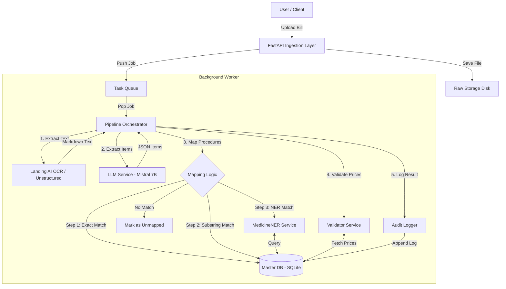

# Medical-bills Fraud Engine

# New Page

## &lt;DOCUMENT TITLE&gt;

---

---

<table border="1" id="bkmrk-document-no.-arca%5C-x" style="width: 103.929%; height: 122.984px; border-collapse: collapse; border-color: rgb(0, 0, 0); border-style: solid;"><tbody><tr style="height: 29.7969px;"><td style="width: 14.6917%; height: 29.7969px; border-color: rgb(0, 0, 0);">Document No.

</td><td style="width: 27.8044%; height: 29.7969px; border-color: rgb(0, 0, 0);">ARCA\\ XXX\\HLD \\xxxx

</td><td style="width: 15.3239%; height: 29.7969px; border-color: rgb(0, 0, 0);">Version

</td><td style="width: 42.1801%; height: 29.7969px; border-color: rgb(0, 0, 0);">x.x.x

</td></tr><tr style="height: 46.5938px;"><td rowspan="3" style="height: 46.5938px; width: 14.6917%; border-color: rgb(0, 0, 0);">Authorised by:

</td><td rowspan="3" style="height: 46.5938px; width: 27.8044%; border-color: rgb(0, 0, 0);">  
</td><td style="width: 15.3239%; height: 46.5938px; border-color: rgb(0, 0, 0);">Signature:

</td><td style="width: 42.1801%; height: 46.5938px; border-color: rgb(0, 0, 0);"></td></tr><tr><td style="width: 15.3239%; border-color: rgb(0, 0, 0);">Date :

</td><td style="width: 42.1801%; border-color: rgb(0, 0, 0);"></td></tr><tr><td style="width: 15.3239%; border-color: rgb(0, 0, 0);">Organization:

</td><td style="width: 42.1801%; border-color: rgb(0, 0, 0);"></td></tr><tr><td style="width: 14.6917%; border-color: rgb(0, 0, 0);">Applicable To:

</td><td colspan="3" style="width: 85.3083%; border-color: rgb(0, 0, 0);"></td></tr><tr style="height: 46.5938px;"><td rowspan="3" style="height: 46.5938px; width: 14.6917%; border-color: rgb(0, 0, 0);">Approved By :

</td><td rowspan="3" style="height: 46.5938px; width: 27.8044%; border-color: rgb(0, 0, 0);">  
</td><td style="width: 15.3239%; height: 46.5938px; border-color: rgb(0, 0, 0);">Signature:</td><td style="width: 42.1801%; height: 46.5938px; border-color: rgb(0, 0, 0);"> </td></tr><tr><td style="width: 15.3239%; border-color: rgb(0, 0, 0);">Date :</td><td style="width: 42.1801%; border-color: rgb(0, 0, 0);">  
</td></tr><tr><td style="width: 15.3239%; border-color: rgb(0, 0, 0);">Organization:</td><td style="width: 42.1801%; border-color: rgb(0, 0, 0);">  
</td></tr></tbody></table>

---

##### **COPYRIGHT NOTICE**

This documentation is the property of ARCA and is intended exclusively for use in ARCA's products. It is not for general distribution and is meant solely for the person to whom it is specifically issued at ARCA. This document must not be shared with any unauthorised person, either within or outside ARCA, including its customers. Copying or unauthorised distribution of this document, in any form or by any means—electronic, mechanical, photocopying or otherwise—is strictly prohibited and illegal.

ARCA  
Bangalore  
India

---

##### **REVISION LIST**

<table border="1" id="bkmrk-ver.-rev-date-author" style="width: 102.024%; border-collapse: collapse; background-color: rgb(194, 224, 244); border: 1px solid rgb(0, 0, 0);"><thead><tr><th style="width: 25.7449%; border-color: rgb(0, 0, 0);">**Ver. Rev**

</th><th style="width: 17.2825%; border-color: rgb(0, 0, 0);">**Date**

</th><th style="width: 22.646%; border-color: rgb(0, 0, 0);">**Author**

</th><th style="width: 34.3266%; border-color: rgb(0, 0, 0);">**Description**

</th></tr></thead><tbody><tr><td style="width: 25.7449%; border-color: rgb(0, 0, 0);"> </td><td style="width: 17.2825%; border-color: rgb(0, 0, 0);"> </td><td style="width: 22.646%; border-color: rgb(0, 0, 0);"> </td><td style="width: 34.3266%; border-color: rgb(0, 0, 0);"> </td></tr><tr><td style="width: 25.7449%; border-color: rgb(0, 0, 0);"> </td><td style="width: 17.2825%; border-color: rgb(0, 0, 0);"> </td><td style="width: 22.646%; border-color: rgb(0, 0, 0);"> </td><td style="width: 34.3266%; border-color: rgb(0, 0, 0);"> </td></tr><tr><td style="width: 25.7449%; border-color: rgb(0, 0, 0);"> </td><td style="width: 17.2825%; border-color: rgb(0, 0, 0);"> </td><td style="width: 22.646%; border-color: rgb(0, 0, 0);"> </td><td style="width: 34.3266%; border-color: rgb(0, 0, 0);"> </td></tr><tr><td style="width: 25.7449%; border-color: rgb(0, 0, 0);"> </td><td style="width: 17.2825%; border-color: rgb(0, 0, 0);"> </td><td style="width: 22.646%; border-color: rgb(0, 0, 0);"> </td><td style="width: 34.3266%; border-color: rgb(0, 0, 0);"> </td></tr></tbody></table>

---

#### **High Level Design Document**

##### **Introduction & Scope**

This High Level Design (HLD) document outlines the architecture, components, and data flow of the Medical Bill Validation Engine. The system is designed to provide robust, auditable, and regulator-safe price validation and fraud detection for hospital bills. It leverages a hybrid approach combining local LLMs (Mistral 7B) for extraction with deterministic validation against a Master Price Database. The primary scope includes file ingestion, OCR, LLM-based mapping, and deterministic price validation.

##### **Architecture Overview**

The system is a modular application comprising a React frontend and a FastAPI backend. It processes medical bills through a multi-stage pipeline.

**Key Layers:**
- **UI Layer:** React-based frontend providing the interface for document upload, review, and analytics.
- **Business Logic Layer:** FastAPI backend incorporating asynchronous background workers for document processing, orchestrating OCR, LLM, and deterministic validation.
- **Data Layer:** SQLite (scalable to PostgreSQL) storing the master price catalog, processed bills, and tamper-proof audit logs.
- **Integrations:** Local Ollama runtime for LLM (Mistral 7B) and OCR services (Unstructured, Tesseract).

##### **Module/Component Design**

1. **Ingestion Layer (app/api/ingestion.py):** Handles file uploads (PDF, JPG, PNG), validates extensions, generates a unique `bill_id`, saves to raw storage, and queues the processing job.
2. **OCR Engine (app/services/ocr.py):** Responsible for raw text extraction using `unstructured` for table inference, with a `pytesseract` fallback for degraded documents.
3. **LLM Service (app/services/llm.py):** Utilizes Mistral 7B (via Ollama) to parse raw OCR output into structured JSON items (`item_name`, `price`) and handles candidate mapping logic.
4. **Pipeline Orchestrator (app/services/orchestrator.py):** The central controller managing the step-by-step processing workflow, including deterministic mapping (Exact, Substring, NER) before LLM fallback.
5. **Deterministic Validator (app/services/validator.py):** Compares extracted prices against the Master Price database, calculates variance, and adjudicates the item as `VALID`, `INVALID` (overpriced), or `REVIEW`.
6. **Audit Logger (app/services/audit.py):** Appends secure, cryptographically hashed (SHA256) entries for every pipeline event to ensure immutability and compliance.

##### **Database & Data Design**

Initially implemented with SQLite (`medical_bills.db`), designed for seamless migration to PostgreSQL for production.

**Major Entities:**
- **MasterPrice:** Holds standard procedure codes, descriptions, and allowed unit prices.
- **Bill:** Contains metadata about the uploaded document (ID, filename, timestamp, overall status).
- **LineItem:** Associates extracted procedure items with a specific `Bill`, storing the extracted price, standard price, mapping confidence, and validation decision.
- **AuditLog:** Records granular system actions per `bill_id`, including OCR results, mapping thresholds, and validation triggers, secured with a sha256 hash.

**Data Flow Formats:**
- **Input:** PDF/Images.
- **Internal Exchange:** JSON (for LLM inter-process communication) and Markdown (for OCR output formatting).

##### **Integration Points**

**APIs (FastAPI):**
- `POST /api/v1/upload`: Synchronous upload endpoint returning a tracking UUID.
- `GET /api/v1/bills/{bill_id}`: Polling endpoint for clients to retrieve validation status and detailed line results.
- `GET/POST /api/v1/master-prices`: Administrative endpoints for CRUD operations on the master price catalog.

**System Integrations:**
- **Ollama Engine:** Communicates locally via HTTP to the Ollama daemon for inference requests (Mistral).
- **OCR Libraries:** Bridges Python memory with system-level binaries (Tesseract) and layout parsing models.

##### **Security Architecture**

- **Data Privacy:** Uses entirely local execution models (Ollama Mistral 7B / Unstructured OCR). No PII or PHI (Protected Health Information) is sent to external cloud APIs, ensuring HIPAA/GDPR compatibility.
- **Integrity & Non-Repudiation:** The Audit Logger mechanism stamps every critical decision (e.g., matching a drug to a code, rejecting a price) with a SHA256 cryptographic hash, making the review history tamper-evident.
- **Data Protection:** Raw files are securely stored in the isolated `raw_storage` volume.

##### **Scalability, Performance & Reliability**

- **Asynchronous Task Queue:** Ingestion is decoupled from the heavy LLM/OCR processing. Bills are queued immediately, allowing the system to absorb high upload concurrency levels.
- **Scaling:** The FastAPI workers and the Background Processor can be scaled horizontally. The local LLM node (Ollama) can be allocated dedicated GPU resources or orchestrated via Kubernetes for load balancing.
- **Performance:** Deterministic and substring mapping is prioritized over LLM calls. LLM mapping is only invoked as a fallback and uses pre-filtered candidate lists (Top 200) to massively reduce token context sizes and latency.

##### **Deployment & Environments**

- **Environments:** Development (local SQLite + local Ollama), Production (Dockerized containers, PostgreSQL data store, dedicated GPU host for Ollama).
- **Deployment Strategy:** `docker-compose.yml` orchestrates the API container, frontend app container, and optional database/Redis instances.

##### **Assumptions & Constraints**

- **LLM Hardware:** It is assumed the host environment has sufficient RAM/VRAM (>8GB) to run the Mistral 7B model locally at acceptable inference speeds.
- **Model Constraints:** Hallucinations are possible, hence the strict deterministic fallback prioritization and constraint logic implemented in the `Orchestrator` module.

##### **Risks & Mitigation**

- **Risk:** High variability in hospital billing layouts leading to OCR failure.
  **Mitigation:** Hybrid OCR approach (Unstructured and Tesseract) paired with an LLM prompt highly immune to formatting aberrations.
- **Risk:** Pricing anomalies in the master database. 
  **Mitigation:** The system flags anomalies as `REVIEW` or `INVALID` rather than autonomously altering prices, ensuring human-in-the-loop governance.

##### **Appendix/Glossary**

- *Hint:* Add additional info, reference materials, and a glossary of terms.
- Subsections:
    
    
    - Reference documents
    - Definitions/acronyms

##### **Tips for Use:**

- Use diagrams wherever possible
- Each module/component should have a clear responsibility described
- Reference related documents (BRD, FRS, TRS) for full context

---

##### **Document Control**

<table border="1" id="bkmrk-version-date-author-" style="width: 107.024%; border-collapse: collapse; background-color: rgb(206, 212, 217); border-color: rgb(126, 140, 141); border-style: solid;"><tbody><tr><td style="width: 9.53516%; border-color: rgb(126, 140, 141);">**Version**

</td><td style="width: 9.77354%; border-color: rgb(126, 140, 141);">**Date**

</td><td style="width: 18.6317%; border-color: rgb(126, 140, 141);">**Author**

</td><td style="width: 62.0596%; border-color: rgb(126, 140, 141);">**Changes**

</td></tr><tr><td style="width: 9.53516%; border-color: rgb(126, 140, 141);"> </td><td style="width: 9.77354%; border-color: rgb(126, 140, 141);"> </td><td style="width: 18.6317%; border-color: rgb(126, 140, 141);"> </td><td style="width: 62.0596%; border-color: rgb(126, 140, 141);"> </td></tr><tr><td style="width: 9.53516%; border-color: rgb(126, 140, 141);"> </td><td style="width: 9.77354%; border-color: rgb(126, 140, 141);"> </td><td style="width: 18.6317%; border-color: rgb(126, 140, 141);"> </td><td style="width: 62.0596%; border-color: rgb(126, 140, 141);"> </td></tr></tbody></table>

##### **Review &amp; Approval**

<table border="1" id="bkmrk-role-name-signature-" style="width: 100.833%; border-collapse: collapse; background-color: rgb(206, 212, 217); border-color: rgb(149, 165, 166); border-style: solid;"><tbody><tr><td style="width: 18.3552%; border-color: rgb(149, 165, 166);">**Role**

</td><td style="width: 26.5793%; border-color: rgb(149, 165, 166);">**Name**

</td><td style="width: 28.6055%; border-color: rgb(149, 165, 166);">**Signature**

</td><td style="width: 26.3409%; border-color: rgb(149, 165, 166);">**Date**

</td></tr><tr><td style="width: 18.3552%; border-color: rgb(149, 165, 166);">Product Owner

</td><td style="width: 26.5793%; border-color: rgb(149, 165, 166);"> </td><td style="width: 28.6055%; border-color: rgb(149, 165, 166);"> </td><td style="width: 26.3409%; border-color: rgb(149, 165, 166);"> </td></tr><tr><td style="width: 18.3552%; border-color: rgb(149, 165, 166);">Technical Lead

</td><td style="width: 26.5793%; border-color: rgb(149, 165, 166);"> </td><td style="width: 28.6055%; border-color: rgb(149, 165, 166);"> </td><td style="width: 26.3409%; border-color: rgb(149, 165, 166);"> </td></tr><tr><td style="width: 18.3552%; border-color: rgb(149, 165, 166);">Program Director

</td><td style="width: 26.5793%; border-color: rgb(149, 165, 166);"> </td><td style="width: 28.6055%; border-color: rgb(149, 165, 166);"> </td><td style="width: 26.3409%; border-color: rgb(149, 165, 166);"> </td></tr><tr><td style="width: 18.3552%; border-color: rgb(149, 165, 166);">Project Manager

</td><td style="width: 26.5793%; border-color: rgb(149, 165, 166);"> </td><td style="width: 28.6055%; border-color: rgb(149, 165, 166);"> </td><td style="width: 26.3409%; border-color: rgb(149, 165, 166);"> </td></tr><tr><td style="width: 18.3552%; border-color: rgb(149, 165, 166);">Compliance Officer

</td><td style="width: 26.5793%; border-color: rgb(149, 165, 166);"> </td><td style="width: 28.6055%; border-color: rgb(149, 165, 166);"> </td><td style="width: 26.3409%; border-color: rgb(149, 165, 166);"> </td></tr></tbody></table>

##### **Contact Information**

**Project Team:**

- Product Owner: \[Contact details\]
- Technical Lead: \[Contact details\]
- Project Manager: \[Contact details\]

**Customer Team:**

- Program Director: \[Contact details\]
- Program Manager: \[Contact details\]

**Support:**

- Helpdesk: \[Phone/WhatsApp\]
- Technical Support: \[Email\]

---

##### **END OF DOCUMENT**